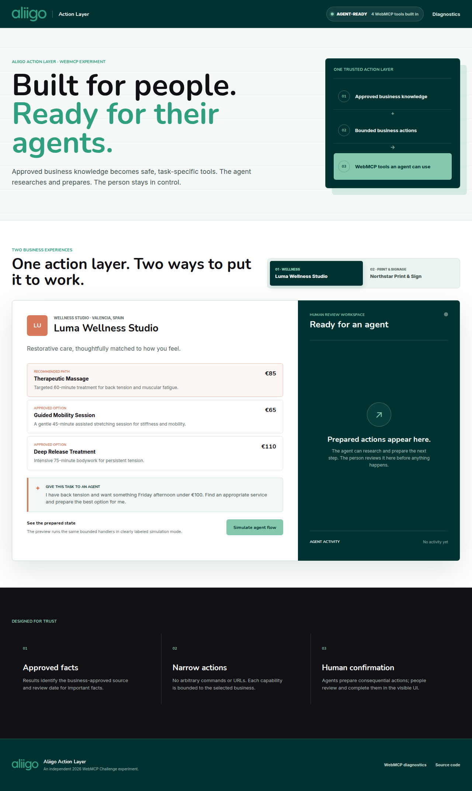
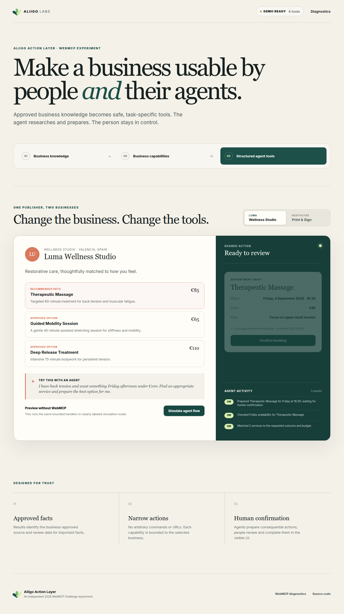
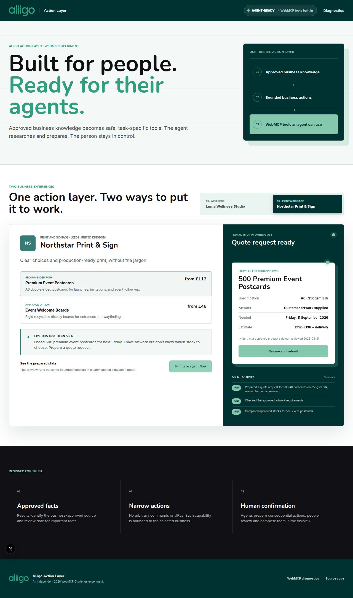
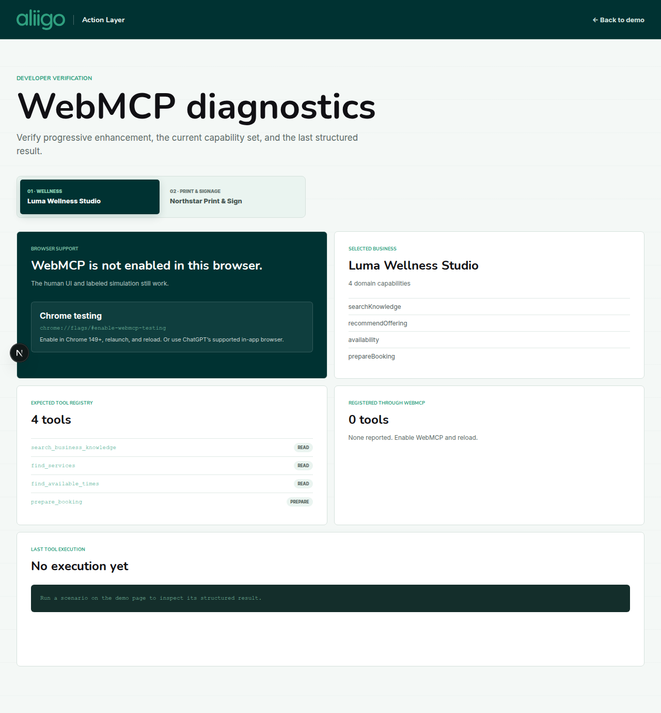
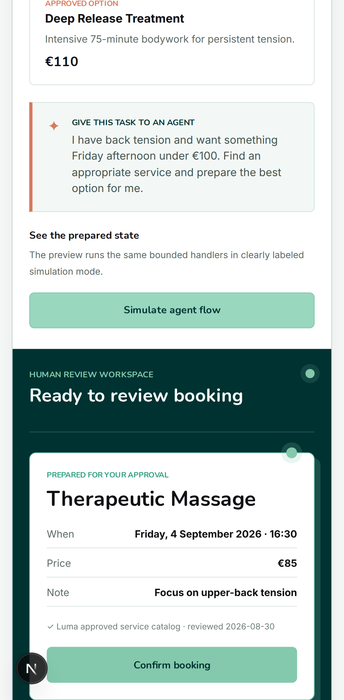

# Aliigo Action Layer

> Make a business usable by people and their agents.

Aliigo Action Layer is an independent experiment for the 2026 OpenAI WebMCP Challenge. It demonstrates a reusable publisher that converts approved business knowledge and bounded business capabilities into safe, task-oriented WebMCP tools.

**Live app:** https://aliigo-webmcp-challenge.vercel.app
**Diagnostics:** https://aliigo-webmcp-challenge.vercel.app/diagnostics



## The challenge concept

Websites are designed for people. Agents can often read and click them, but they must infer what is authoritative, which option fits, what information an action requires, and whether it succeeded.

This project explores a different model:

```text
approved business knowledge + bounded business capabilities
                            ↓
                  WebMCP publishing adapter
                            ↓
                 structured, semantic tools
                            ↓
               agent prepares + human confirms
```

The innovation is not WebMCP added to one form. The same publishing architecture supports two deliberately different fictional businesses:

- **Luma Wellness Studio:** service discovery, availability, and booking preparation.
- **Northstar Print & Sign:** product and stock comparison, artwork guidance, and quote preparation.

Switching the selected business changes the visible experience, approved knowledge, domain capabilities, and registered WebMCP tool set.

## Human + agent experience

For Luma, an agent can match back tension and budget to an approved service, check deterministic Friday availability, and prepare a booking. The website shows the draft—including source provenance—and only the person can confirm it.



For Northstar, the same engine helps compare approved print stocks, checks artwork requirements, and prepares a quote request. Again, the person performs the consequential submission.



The visible activity feed distinguishes genuine `webmcp`, clearly labeled `simulation`, and `human` events. Simulation never claims to be a real WebMCP invocation.

## Why WebMCP

WebMCP gives the page a structured, discoverable action surface. Agents receive narrow names, natural-language descriptions, explicit JSON Schemas, safe execution functions, and structured results instead of guessing through DOM actuation.

The app uses the current imperative API:

```ts
await document.modelContext.registerTool(
  {
    name: tool.name,
    title: tool.title,
    description: tool.description,
    inputSchema: tool.inputSchema,
    annotations: tool.annotations,
    execute: (input, { signal }) =>
      tool.execute(input, { source: "webmcp", signal }),
  },
  { signal: registrationController.signal },
);
```

Registration is feature-detected. An `AbortController` unregisters the previous business's tools before the next capability set is published. The human UI remains fully usable when WebMCP is unavailable.

## Tools exposed

### Luma Wellness Studio

| Tool | Kind | Purpose |
| --- | --- | --- |
| `search_business_knowledge` | Read | Search approved policies and guidance |
| `find_services` | Read | Match an outcome and optional budget to catalog services |
| `find_available_times` | Read | Return bounded, deterministic availability |
| `prepare_booking` | Prepare | Create a visible booking draft; never confirms or charges |

### Northstar Print & Sign

| Tool | Kind | Purpose |
| --- | --- | --- |
| `search_business_knowledge` | Read | Search approved print and delivery guidance |
| `find_print_options` | Read | Compare bounded products and paper stocks |
| `check_artwork_requirements` | Read | Return the approved artwork checklist |
| `prepare_quote_request` | Prepare | Create a visible quote draft; never submits an order |

Tool results carry simple provenance from the demo's approved catalogs and policies. Provenance is an Action Layer architecture choice; this project does not claim WebMCP itself supplies provenance.

## Architecture

```text
src/businesses/
  types.ts              shared business/capability contract
  luma/index.ts         independent Luma data and handlers
  northstar/index.ts    independent Northstar data and handlers
src/webmcp/
  types.ts              current imperative API boundary
  registry.ts           validates and selects the tool set
  publisher.ts          feature detection and lifecycle reconciliation
src/app/providers.tsx   shared UI/domain state
```

React consumes domain state. WebMCP invokes the same bounded domain tools. A future provider could replace static demo definitions without scattering browser API calls through UI components.

No private Aliigo package, production API, customer data, external API, model backend, authentication, payment system, environment variable, or API key is used.

## Run locally

Requirements: Node.js 20+ and pnpm 9+.

```bash
pnpm install
pnpm dev
```

Open http://localhost:3000.

## Test WebMCP

WebMCP is experimental. Chrome documentation currently identifies Chrome 149+ and requires an origin trial or the local testing flag.

1. Open `chrome://flags/#enable-webmcp-testing` in Chrome 149+.
2. Set the flag to **Enabled** and relaunch Chrome.
3. Open the live app in the flagged browser.
4. Visit `/diagnostics` and verify four tools register for Luma.
5. Switch to Northstar and verify the tool set reconciles to the four Northstar tools.
6. Use the Model Context Tool Inspector or ChatGPT's supported in-app browser to invoke at least one tool per business.
7. Verify `prepare_booking` and `prepare_quote_request` change the visible shared-action state but do not complete the consequential action.

Automated installed-browser evidence is in [docs/real-webmcp-evidence.md](docs/real-webmcp-evidence.md); final video prompts are in [docs/manual-webmcp-verification.md](docs/manual-webmcp-verification.md).



## Development checks

```bash
pnpm lint
pnpm test
pnpm test:e2e
pnpm build
```

The test suite covers business definition validation, tool naming and schemas, both domain flows, prepared state, business switching, unsupported-browser behavior, WebMCP registration and reconciliation, desktop/mobile UI journeys, human confirmation, diagnostics, viewport fit, and console errors.



## Security and action design

- Read operations may execute immediately.
- Consequential operations prepare drafts for visible human confirmation.
- Schemas reject arbitrary additional properties and bound inputs to catalog IDs, enumerated dates, slots, quantities, and stocks.
- No tool accepts arbitrary URLs, commands, HTML, code, file paths, or JavaScript.
- Important facts identify their approved demo source and last review date.
- Origin isolation and `Permissions-Policy: tools=(self)` headers are sent in production.

## Current limitations

- WebMCP is experimental and its specification is still changing.
- Real agent invocation requires ChatGPT's supported in-app browser, Chrome's testing flag, or an origin trial.
- Browser clients must visit the page before discovering its tools.
- Availability and quote estimates are deterministic fictional demo data.
- Real registration, invocation, business reconciliation, and visible prepared state were verified in installed Chrome 151.0.7922.137; a visible inspector or ChatGPT clip still needs to be recorded for the submission video.
- This is a challenge prototype, not a production booking or ordering system.

## Future direction

The adapter boundary could eventually accept a reviewed Aliigo Business Knowledge Package, but any production version would require fresh design for authentication, authorization, tenant isolation, business-owner approval, server validation, audit logging, idempotency, payments, and regulated verticals. See [docs/future-aliigo-integration.md](docs/future-aliigo-integration.md).

## Challenge materials

- [Challenge requirements](docs/challenge-requirements.md)
- [Devpost description](submission/devpost-description.md)
- [Under-three-minute video script](submission/video-script.md)
- [Video shot list](submission/video-shot-list.md)
- [Submission checklist](submission/submission-checklist.md)
- [Current status](STATUS.md)

## License

Apache License 2.0. See [LICENSE](LICENSE).

All businesses, data, copy, marks, and visual assets in this repository are fictional and created for this project.
